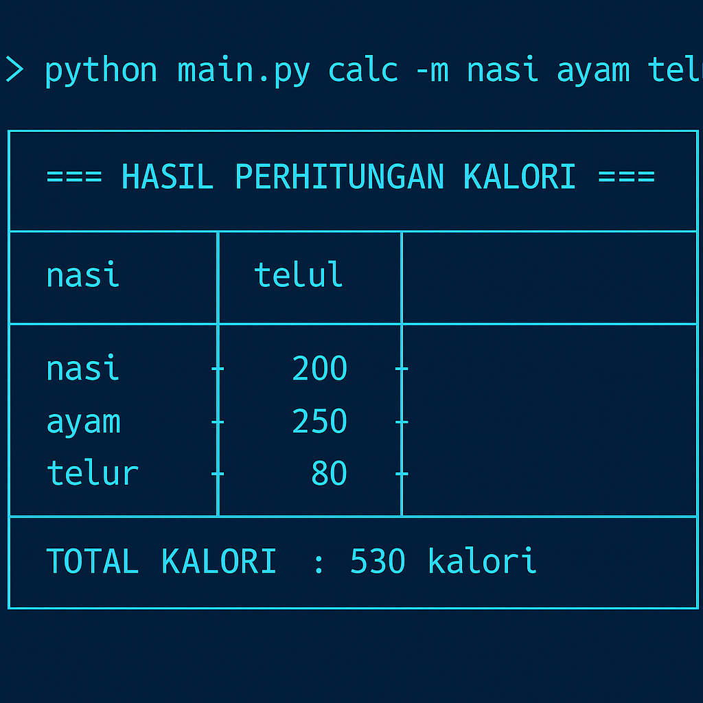
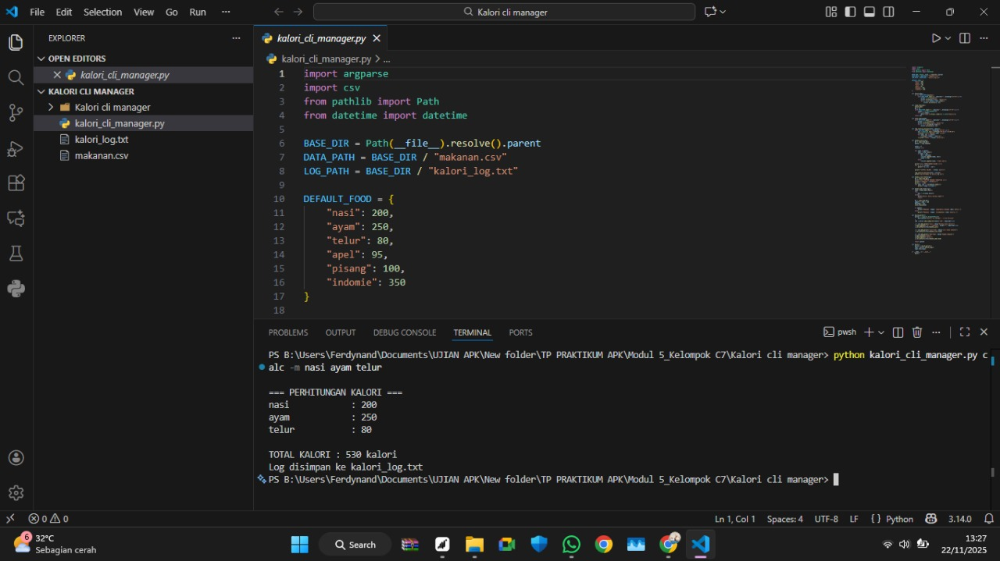

# Kalori CLI Manager


## Screenshot


## 🖥️ Preview Output Program

### 1️⃣ Perhitungan kalori: nasi + ayam + telur


---

### 2️⃣ Perhitungan kalori: indomie + apel + pisang


---

### 3️⃣ Perhitungan kalori: apel + ayam + nasi


---

### 📋 Daftar makanan dalam database


# 🍽 Kalori CLI Manager

Aplikasi CLI (Command Line Interface) untuk menghitung total kalori harian secara cepat menggunakan argparse.
Program ini dijalankan melalui Command Line (CMD/Terminal) menggunakan Python.

Buka folder tempat file disimpan
Contoh di Windows :
-Klik kanan pada folder project
-Pilih “Open in Terminal / Open in Command Prompt”
Cara Menjalankan Aplikasi

Pastikan Python sudah ter-install (minimal Python 3.10+).

1. Menjalankan perhitungan kalori
Hitung total kalori berdasarkan daftar makanan :
```bash
python kalori_cli_manager.py calc -m nasi ayam telur
```
Output contoh:
```bash
=== PERHITUNGAN KALORI ===
nasi            : 200
ayam            : 250
telur           : 80

TOTAL KALORI : 530 kalori
Log disimpan ke kalori_log.txt
```
2. Menampilkan daftar makanan dalam database
```bash
python kalori_cli_manager.py list-food
```
Output contoh:
```bash
 DAFTAR MAKANAN TERDAFTAR
Makanan             Kalori
---------------------------
apel                95
ayam                250
indomie             350
nasi                200
pisang              100
telur               80

```
3. Tambah atau update makanan baru
Output contoh :
```bash
Makanan 'kentang' ditambahkan (120 kalori).
Makanan 'ayam' diperbarui menjadi 250 kalori.
```
4. File log otomatis tersimpan
Setiap perhitungan akan dicatat ke :
```bash
kalori_log.txt
```
Contoh isi log :
```bash
=== SESSION 2025-11-22 07:00:00 ===
nasi : 200
ayam : 250
telur : 80
TOTAL = 530 kalori
```
5. Struktur folder setelah berjalan
```bash
kalori_cli_manager.py
makanan.csv
kalori_log.txt   ← otomatis dibuat
README.md
requirements.txt

TABEL
Panduan Perintah Cepat

| Fungsi                        | Perintah                                        | Contoh Output Singkat        |
|------------------------------|------------------------------------------------|------------------------------|
| Hitung total kalori          | `python kalori_cli_manager.py calc -m ...`     | TOTAL KALORI : 530 kalori    |
| Lihat daftar makanan         | `python kalori_cli_manager.py list-food`       | Tampil tabel makanan         |
| Tambah / update makanan      | `python kalori_cli_manager.py add-food ...`    | Makanan ditambahkan/update   |
| Lokasi penyimpanan log       | *otomatis dibuat* `kalori_log.txt`             | Riwayat setiap session       |
| Edit database manual         | Edit file `makanan.csv`                        | Update nilai kalori          |
